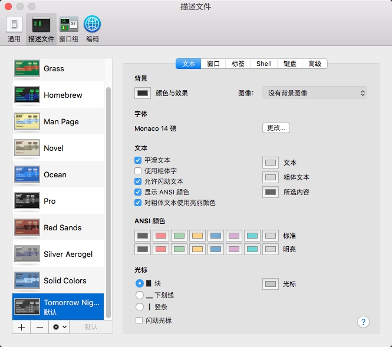
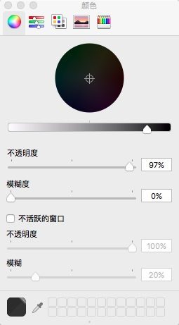
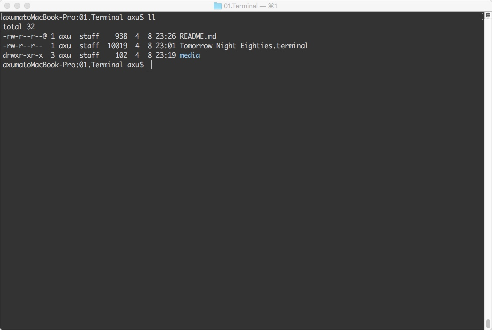

### 01.Terminal配置说明

#### 安装流程

```bash
# 下载
> cd /Users/axu/code/axuProject
> pwd
/Users/axu/code/axuProject

> git clone https://github.com/axu4github/configuration.git
> cd /Users/axu/code/axuProject/configuration/01.Terminal
> ll
total 32
-rw-r--r--@ 1 axu  staff    670  4  8 23:17 README.md
-rw-r--r--  1 axu  staff  10019  4  8 23:01 Tomorrow Night Eighties.terminal
drwxr-xr-x  3 axu  staff    102  4  8 23:19 media

# 进入目录
# 双击 "Tomorrow Night Eighties.terminal" 文件
> open . 

# 点击左上 "终端 > 偏好设置" 或者 按 "command + ,"
# 按照如下图参数进行配置
```





```bash
# 在`~/.profile`文件中添加如下配置
> vim ~/.profile
[...]
export CLICOLOR=1
#export LSCOLORS=gxfxaxdxcxegedabagacad 
export LSCOLORS=ExFxCxDxBxegedabagacad

# 使配置生效
> source ~/.profile

# 检查
> ll
```




