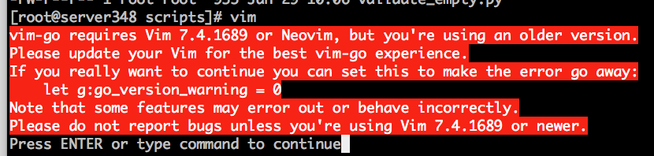

# 02. Vim 配置

## 安装

> Vim 配置主要使用 https://github.com/humiaozuzu/dot-vimrc 最新安装文件详见 [安装文档](https://github.com/humiaozuzu/dot-vimrc#installation)

```bash
# 以下摘录 dot-vimrc 安装文档 - 20180201
# 1. Backup your old vim configuration files:
> mv ~/.vim ~/.vim.orig
> mv ~/.vimrc ~/.vimrc.orig

# 2. Clone and install this repo:
> git clone git://github.com/humiaozuzu/dot-vimrc.git ~/.vim
> ln -s ~/.vim/vimrc ~/.vimrc

# 3. Setup Vundle:
> git clone https://github.com/gmarik/vundle.git ~/.vim/bundle/vundle

# 4. Install bundles. Launch vim (ignore the errors and they will disappear after installing needed plugins)
> vim

# 5. :run
:BundleInstall
```

## 错误解决

### vim-go requires Vim 7.4.1689 or Neovim, but you're using an older version.



```bash
> echo "let g:go_version_warning = 0" >> ~/.vimrc
```
